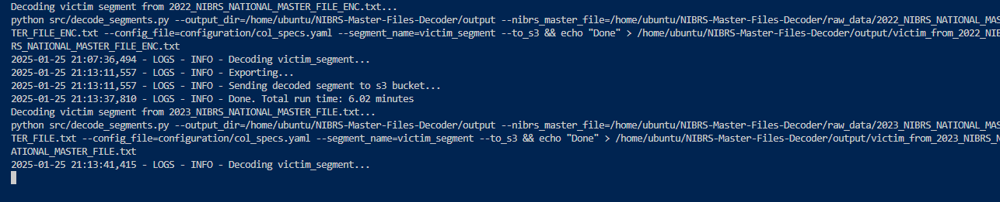
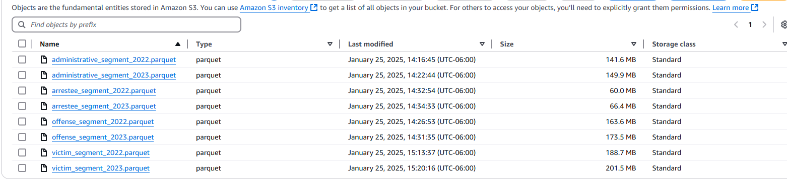

# National Crime Data Warehouse (NIBRS)

This is a data science and engineering solution that democratizes the FBI's national crime data assets at the incident level, eventually culminating to a machine learnhing model as a proof of concept. It is inspired by my work as a Quantitative Researcher at UChicago Urban Labs, a policy think tank with five practice areas: criminal justice, economic mobility, education, health, and sustainability. I aim to learn and apply four competencies:
1. Dimensional data modeling: Implement data transformations in dbt using a star schema.
2. Machine Learning: Predict the clearance probability of larceny thefts conditional on covariates such as property value and victim-offender relationships.
3. Cloud Computing: Integrate Amazon Web Services (AWS) where *it makes sense.*
4. Containerization: Deploy everything in a Docker container.

Disclaimer: This repo is strictly my *own* work outside regular business hours.

### Requirements
- Python 3.10, GNU Make, GNU Bash
- Amazon S3
- (optional) Amazon EC2: I am using an m4.4xlarge instance with 16 vCPU and 64 GB RAM, plus 40 GB in EBS storage.

### About
Through the FBI Crime Data Explorer (CDE), the FBI releases National Incident-Based Reporting System (NIBRS) data every year dating back to 1991. These so-called master files are the most comprehensive and centralized resource for *incident-level* public safety data, including but not limited to crime; arrest; and victim segments for over 13,000 law enforcement agencies across the United States. The data is in a fixed-length, ASCII text format: every n characters is a distinct column, with the first two characters delineating between different segments. There exists one master file per year. The schemas of each segment can be found in the FBI CDE (see the yellow circle in the screenshot below), enumerated in a poorly-scanned document from 1995. For 2023 and beyond, the FBI released the documentation as a proper .pdf entitled "2023.0 NIBRS Technical Specification:" https://le.fbi.gov/informational-tools/ucr/ucr-technical-specifications-user-manuals-and-data-tools.

### Instructions
1. Clone this repo and navigate to the parent directory, the same directory as this `README.md`.
1. Download the NIBRS fixed-length, ASCII text files from the FBI CDE, then store it in `raw_data/`. At this point, it should be a .zip file (e.g., `nibrs-2022.zip`) at around 500 MB in size. Do not unzip it.
1. To send the desired segments to your Amazon S3 bucket, as defined in `configuration/col_specs.yaml`'s `s3_bucket` key, store your secrets as environment variables: `region_name`, `aws_access_key_id`, and `aws_secret_access_key`. This is the default behavior of `Makefile`. However, if you prefer to store the data locally, delete the `to_s3` flag in line 42.
1. Do `conda activate nibrs`, then `make`.

1. The NIBRS segments (.parquet) are now on Amazon S3.

### AWS Resources
1. Amazon S3 pricing: https://aws.amazon.com/s3/pricing/
1. IAM: https://stackoverflow.com/questions/46199680/difference-between-iam-role-and-iam-user-in-aws
1. How to SSH into your EC2 instance from VS Code: https://stackoverflow.com/questions/56996544/vs-code-remote-ssh-to-aws-instance
