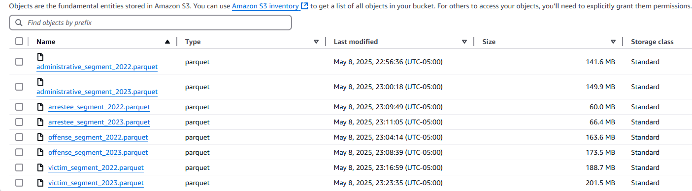

# National Crime Data Warehouse (NIBRS)

### About
This is—or rather will be—a national crime data warehouse, engineered using Python and PostgreSQL with Amazon Web Services (AWS) integration. It is inspired by my work as a Research Intelligence Engineer at Urban Labs, a research organization dedicated to analytics for social good. The Labs are comprised of five labs, but my primary function falls under the Crime Lab. I aim to
1. build data engineering competencies, such as dbt and Apache Airflow, through an end-to-end ELT pipeline;
2. and get comfortable with the AWS ecosystem, both interactively and through the Python API (`boto3`).

Diclaimer: This repo is strictly my *own* work outside business hours, despite its relevance to my present line of work.

### Requirements
- Python (`requirements.yml`)
- GNU Bash, GNU Make
- Amazon S3 as a data lake
- (optional) Amazon EC2 as an analytics environment (I am using an m4.4xlarge instance for this project with 16 vCPU and 64 GB RAM, plus 40 GB in EBS storage)

### About
Through the FBI Crime Data Explorer (CDE), the FBI releases National Incident-Based Reporting System (NIBRS) data every year dating back to 1991. These so-called master files are the most comprehensive and centralized resource for *incident-level* public safety data, including but not limited to crime; arrest; and victim segments for over 13,000 law enforcement agencies across the United States. The data is in a fixed-length, ASCII text format: every n characters is a distinct column, with the first two characters delineating between different segments. There exists one master file per year. The schemas of each segment can be found in the FBI CDE (see the yellow circle in the screenshot below), enumerated in a poorly-scanned document from 1995. For 2023 and beyond, the FBI seems to have released the documentation as a proper .pdf entitled "2023.0 NIBRS Technical Specification:" https://le.fbi.gov/informational-tools/ucr/ucr-technical-specifications-user-manuals-and-data-tools.

**My goals are to**
1. **develop a tool to seamlessly decode \& extract NIBRS data segments;**
2. **make the mechanism publicly available for others;**
3. **host the decoded segments in Amazon S3;**
4. **process and harmonize the data onto a PostgreSQL database, using either an EC2 or Amazon RDS instance;**
5. **create a dashboard to visualize agency-level public safety statistics and reporting compliance;**
6. **and explore ethical \& responsible machine learning applications in policing, like predicting clearances of crime in the spirit of resource allocation.**

### Project Folder Structure
1. `src/` is the bread-and-butter of this repo: the scripts in this directory orchestrate the ETL pipeline.
1. `src/utils/` and `src/db_design/` contain the modules I developed—and continue to refine—to abstract away the core functionalities of `src/`. While `src/utils/` is specifically for the decoder tool and AWS integration features, `src/db_design/` is for all things SQL.
1. `configuration/` is simply where I store configurable parameters as .yaml files.

### Instructions (for decoder tool only)
1. Clone this repo and navigate to the parent directory, the same directory as this `README.md`.
1. Download the NIBRS fixed-length, ASCII text files from the FBI CDE, then store it in `raw_data/`; at this point, it should be a zip file (e.g., `nibrs-2022.zip`) at around 500 MB in size. Do not unzip it.
1. To send the decoded NIBRS segments to your Amazon S3 bucket, as defined in `configuration/col_specs.yaml`'s `s3_bucket` key, store your secrets as environment variables: `region_name`, `aws_access_key_id`, and `aws_secret_access_key`. Note that this is the default behavior of `Makefile`. However, if you would like to store the data locally, delete the `to_s3` flag in line 44.
1. Do `conda activate nibrs`, then do `make`.

1. The decoded NIBRS segments in .parquet format are now on Amazon S3.

### AWS Resources
1. Amazon S3 pricing: https://aws.amazon.com/s3/pricing/
1. IAM: https://stackoverflow.com/questions/46199680/difference-between-iam-role-and-iam-user-in-aws
1. How to SSH into your EC2 instance from VS Code: https://stackoverflow.com/questions/56996544/vs-code-remote-ssh-to-aws-instance
